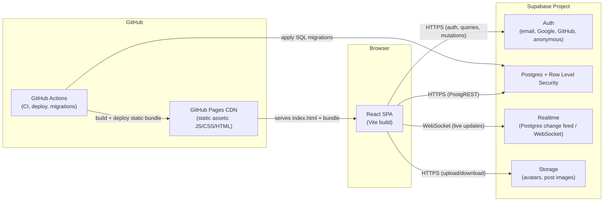

# Architecture

## What CareCircle is

CareCircle is a community platform for people living with chronic illness —
not one illness, all of them. Think Reddit's community structure, Discord's
real-time chat, Quora's Q&A format, and PatientsLikeMe's condition-tracking
focus, combined into one product. A member can join a community for their
specific condition (or several — comorbidity is the norm, not the
exception), post and comment, ask questions, chat in real time, and find
people who understand what they're dealing with.

This document describes the system as a whole: why it's built the way it
is, what the pieces are, and where its known limitations are.

## Why Vite SPA + Supabase

The hosting budget for this project is $0. That constraint drives most of
the architecture:

- **GitHub Pages is static-only.** It serves files over a CDN; it cannot
  run server-side code, hold a database connection, or execute anything on
  a schedule. There is no Node process, no API route, no server.
- Because there's no server, every piece of "backend" — authentication,
  data storage, authorization, real-time updates, file storage — has to
  come from somewhere that offers those as a hosted, free-tier service.
  **Supabase** covers all of it from one project: Postgres (with Row Level
  Security as the authorization layer), Realtime (Postgres change feeds
  over WebSockets, used for chat and live notifications), Storage
  (avatars, post images), and Auth (email + OAuth + anonymous sessions).
- The frontend is therefore a pure client-side single-page app: React
  renders in the browser, and the Supabase JS client talks directly to
  Supabase's hosted APIs over HTTPS/WebSocket. GitHub Pages just serves the
  static HTML/JS/CSS bundle that boots that app.

This is a genuine architectural tradeoff, not a free lunch — see
[SEO / social previews](#seo-and-social-preview-limitations) below for the
biggest cost of it.

### Future migration path

If the project outgrows what a static SPA + Supabase free tier can do
(custom server-side logic beyond what Postgres functions/RLS can express,
SSR for SEO, heavier compute, cost control at scale), the intended
next step is **Vercel or Next.js** (keeps the React codebase, adds an SSR
layer and API routes) or, if more control is needed, a move to **AWS or
GCP** behind a proper backend service.

That migration is designed to be cheap *by construction*: all
Supabase-touching code lives behind a `services/` layer and per-feature
`api/` modules (e.g. `src/features/posts/api/`), never called directly
from UI components. A component calls `useCreatePost()` (a TanStack Query
hook), not `supabase.from('posts').insert(...)` inline in JSX. Swapping the
transport — Supabase JS client today, a REST/tRPC/GraphQL API against a
Next.js backend tomorrow — means rewriting the contents of that layer, not
hunting through every component tree in the app.

## System diagram

In prose: the browser loads a static bundle from GitHub Pages, then talks
directly to Supabase for everything dynamic. GitHub Actions is the only
thing that touches both sides — it builds and publishes the static bundle
to Pages, and separately applies schema migrations to Postgres. There is no
other server in the picture.

## Tech stack

| Layer | Choice | Why |
|---|---|---|
| Build tool | Vite | Fast dev server and build; first-class static output for GitHub Pages. |
| UI framework | React 19 + TypeScript | Large ecosystem, strong typing, matches the component-heavy UI this product needs (feeds, threads, modals, chat). |
| Routing | React Router | Standard client-side router for SPAs; handles nested community/post routes. |
| Styling | Tailwind CSS v4 | Utility-first CSS keeps a large, fast-moving component set visually consistent without a separate design-token build step. |
| Primitives | Radix UI | Unstyled, accessible primitives (dialog, dropdown, tabs, tooltip, etc.) — accessibility and keyboard behavior for free, styling stays ours via Tailwind. |
| Motion | Framer Motion | Declarative animation for feed transitions, modals, and chat — the interaction polish this product's UX depends on. |
| Server state | TanStack Query | Caching, refetching, and invalidation for all Supabase reads/writes; keeps data-fetching logic out of components. |
| Client state | Zustand | Small, unopinionated store for UI-only state (open modals, draft state, theme) that doesn't belong in server cache. |
| Forms | React Hook Form + Zod | Performant form state plus schema validation shared between client-side checks and (conceptually) the shape of what the API expects. |
| Content authoring | Markdown write/preview editor (GitHub-style tabs) | Plain-textarea input, `react-markdown` + `rehype-sanitize` for the preview and final render — avoids the complexity/bundle cost of a WYSIWYG editor for M1; a richer editor (e.g. Tiptap) is a reasonable M6 polish upgrade if needed. |
| Backend client | Supabase JS client | Single client for Auth, Postgres (via PostgREST), Realtime, and Storage — the entire backend surface. |
| Linting / formatting | oxlint + Prettier | oxlint (Rust-based) covers correctness/a11y/react-hooks rules fast enough to run on every save; Prettier owns formatting only, so the two never fight over style rules. |
| Testing | Vitest + React Testing Library | Fast, Vite-native unit/component testing; same config and transform pipeline as the app itself. |

## SEO and social-preview limitations

This is a client-rendered SPA served from a static CDN — there is no server
to run per-request logic. That has one significant, known consequence:
**no true dynamic Open Graph / Twitter Card metadata.**

When someone pastes a link to a specific post into Discord, Twitter/X, or
Slack, the link-unfurling bot fetches the raw HTML at that URL *without*
executing JavaScript. Because `index.html` is the same static file for
every route, every shared link unfurls with the same generic title/image —
there's no way to serve "Sarah's post about managing POTS flare-ups" as the
preview for that specific post's URL, because that would require
server-side rendering (or at least a per-URL prerender step) that a static
GitHub Pages deployment can't do.

This is an accepted tradeoff for staying on the free tier. It's partially
mitigated in-browser with `react-helmet-async`, which updates the
`<title>` and meta tags client-side once the app has loaded and fetched the
post — so a user who's already on the page gets a correct tab title and
in-app experience, and search engines that do execute JavaScript (Google's
crawler does, most social unfurlers don't) will still see the tags
eventually. The full fix — real per-URL Open Graph tags for unfurlers — is
planned as part of an eventual SSR migration (see
[Future migration path](#future-migration-path)), not something scoped for
the current architecture.

## Milestone roadmap

The build is sequenced in milestones. Earlier milestones are load-bearing
for later ones (e.g. you need auth and communities before posts make
sense, moderation before public launch).

- **M0 — Foundation.** Repo scaffolding, CI/CD, Supabase project, base
  schema/extensions, design system primitives. (This is the milestone this
  documentation and these workflows belong to.)
- **M1 — Core social loop.** Auth, communities, posts, nested comments,
  voting. The minimum for the product to function as a forum.
- **M2 — Engagement, chat, search.** Realtime chat/DMs, notifications,
  full-text/trigram search, saved posts.
- **M3 — Trust & safety.** Reporting, content moderation queues, blocking/
  muting, rate limiting.
- **M4 — Admin & governance.** Admin dashboards, moderator tooling,
  community creation/approval workflows, audit logs.
- **M5 — Reputation.** Karma/reputation scoring, badges, trusted-contributor
  signals.
- **M6 — Polish.** Performance passes, accessibility audit, mobile-web
  responsiveness, onboarding flow.
- **M7+ — Future roadmap (design-doc only, not built).** Ideas under
  consideration for after the core product is stable: an AI health
  assistant (symptom triage / summarization, not diagnosis), verified
  doctor accounts, structured symptom tracking, and native mobile apps.
  None of this is scheduled or scaffolded yet — listed here so future
  architecture decisions (e.g. the SSR migration) can be made with these in
  mind rather than closing doors on them.
