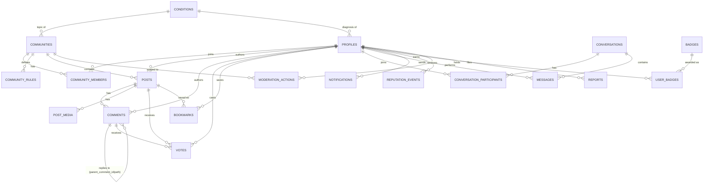

# Database Schema

> **Authoritative source of truth is the SQL in `supabase/migrations/`.**
> This document is a human-readable companion that explains what each table
> is *for* and how the pieces relate — it is not generated from the
> migrations and is not a target for a generator to produce migrations
> from. When the two disagree, the migrations win; update this doc to
> match, not the other way around.

## Conventions used throughout

- **Primary keys**: `uuid`, default `gen_random_uuid()` (from the `pgcrypto`
  extension).
- **Timestamps**: `created_at timestamptz not null default now()`; tables
  that are ever updated in place also get `updated_at timestamptz`,
  maintained by the shared `public.set_updated_at()` trigger.
- **Soft delete**: see [Soft-delete convention](#soft-delete-convention)
  below — posts and comments are never hard-deleted by normal user action.
- **Search**: `pg_trgm` trigram indexes back fuzzy/`ILIKE` search on names,
  titles, and usernames (full-text/trigram search UI is an M2 feature —
  the indexes exist now so it's additive, not a schema change, later).
- **Nested comments**: comment threading uses an `ltree` materialized path
  (`comments.path`, root-to-node) rather than recursive CTEs, so a full
  thread can be fetched and ordered with a single indexed range query. The
  path label for each comment is its own `id` with hyphens replaced by
  underscores (ltree labels can't contain hyphens).
- **Cached counters**: `posts.score`, `comments.score`, `posts.comment_count`,
  `communities.member_count`, and `profiles.reputation_score` are all
  trigger-maintained caches over an authoritative source (`votes`,
  `comments`, `community_members`, `reputation_events` respectively) —
  never written directly by a client. See [RLS strategy](#row-level-security-rls-strategy).

## Domains

### Identity & taxonomy

| Table | Purpose | Key columns | Relationships |
|---|---|---|---|
| `profiles` | Public profile; 1:1 with `auth.users`, auto-created by `handle_new_user()` on signup with a placeholder username. | `id` (= `auth.users.id`), `username`, `display_name`, `bio`, `avatar_url`, `banner_url`, `diagnosis_condition_id`, `diagnosis_year`, `verified_diagnosis`, `reputation_score`, `privacy_settings`/`notification_settings` (jsonb), `theme_preference`, `onboarding_completed` | `diagnosis_condition_id` → `conditions`; referenced by nearly every other domain as the "actor". |
| `conditions` | Controlled taxonomy of chronic illnesses (Lupus, Fibromyalgia, POTS, ...). Backs both `profiles.diagnosis_condition_id` and `communities.condition_id`. | `id`, `name`, `slug`, `category` | Referenced by `profiles` and `communities`. |
| `roles` / `permissions` / `role_permissions` | Site-wide RBAC catalog (not per-community — that's `community_members.role`). | `roles.name`, `permissions.name` | `role_permissions` joins them many-to-many. |
| `user_roles` | Site-wide role grants (e.g. who is a site admin). | `user_id`, `role_id`, `granted_by` | → `profiles`, → `roles`. |
| `follows` | Directed follow graph. | `follower_id`, `followee_id` | `profiles` × `profiles`; self-follow blocked by a CHECK constraint. |

### Communities

| Table | Purpose | Key columns | Relationships |
|---|---|---|---|
| `communities` | A condition-focused space (subreddit/server equivalent). New communities start `is_approved = false` pending admin review. | `id`, `slug`, `name`, `condition_id` (nullable), `member_count`, `is_approved`, `created_by` | → `conditions`; has many `posts`, `community_members`. |
| `community_members` | Membership roster **and** the per-community moderator list — `role = 'moderator'`/`'admin'` makes a member a moderator/admin of that community. No separate moderators table. | `community_id`, `user_id`, `role` | `communities` × `profiles`. Drives `is_moderator_of()`. |
| `community_rules` / `community_resources` / `wiki_pages` | Ordered rules list, curated resource links, and wiki pages for a community. | `community_id`, `title`/`content`, `position` | → `communities`. |

### Content

| Table | Purpose | Key columns | Relationships |
|---|---|---|---|
| `posts` | A top-level submission. `post_type` covers text/image/link/poll plus the health-specific types (question, experience, success_story, treatment/medication/doctor/hospital review, research_discussion, lifestyle_tip). | `id`, `community_id`, `author_id` (nullable), `post_type`, `title`, `body`, `url`, `status`, `score`, `comment_count`, `is_pinned`/`is_locked`/`is_nsfw`/`is_spoiler` | → `communities`, → `profiles` (author, `ON DELETE SET NULL`). |
| `post_media` | Attached images/video for image-type posts. | `post_id`, `storage_path`, `media_type`, `position` | → `posts`; `storage_path` points into the `post-media` Storage bucket. |
| `post_versions` | Insert-only edit-history snapshots, written just before an edit is applied. | `post_id`, `title`, `body`, `edited_by` | → `posts`. |
| `poll_options` / `poll_votes` | Single-choice poll options and ballots for `post_type = 'poll'`. | `poll_option_id`, `user_id`, denormalized `post_id` | One vote per user per poll, enforced by `UNIQUE(post_id, user_id)`. |
| `drafts` | Autosave drafts, private to the owner. | `user_id`, `community_id` (nullable), `title`, `body` | → `profiles`. |
| `tags` / `post_tags` | Free-form tags (Pain, Medication, Exercise, ...) and their post associations. | `tags.slug`, `post_tags` join | `posts` × `tags`. |
| `comments` | Threaded replies to a post or another comment, unlimited depth via `ltree`. | `id`, `post_id`, `author_id` (nullable), `parent_comment_id`, `body`, `path`, `score`, `status` | → `posts`; self-referential via `parent_comment_id`/`path`. |
| `votes` | One row per (voter, target); `value` is `1` or `-1`. Polymorphic over post **or** comment via two nullable FKs plus a `CHECK(num_nonnulls(post_id, comment_id) = 1)` constraint. | `user_id`, `post_id` or `comment_id`, `value` | `UNIQUE(user_id, post_id)` / `UNIQUE(user_id, comment_id)` (Postgres ignores NULLs in unique constraints, so both coexist correctly). Aggregated into `posts.score`/`comments.score` by trigger. |
| `reactions` | Emoji reactions — same polymorphic shape as `votes`, many per user per target (one per distinct emoji). | `user_id`, `post_id`/`comment_id`, `emoji` | Same polymorphism pattern as `votes`. |
| `bookmarks` | A user's saved posts. | `user_id`, `post_id` | `profiles` × `posts`. |

### Messaging

| Table | Purpose | Key columns | Relationships |
|---|---|---|---|
| `conversations` | A DM, group chat, or community-wide chat thread (`community_id` set for the latter). | `id`, `is_group`, `community_id` (nullable) | Has many `conversation_participants`, `messages`. |
| `conversation_participants` | Membership in a conversation, plus read-state for unread badges. | `conversation_id`, `user_id`, `last_read_at` | `conversations` × `profiles`. |
| `messages` | A chat message. `sender_id` is nullable (`ON DELETE SET NULL`) so history survives account deletion. | `conversation_id`, `sender_id`, `body`, `attachment_url` | → `conversations`, → `profiles`. Delivered live via Supabase Realtime. |

### Notifications

| Table | Purpose | Key columns | Relationships |
|---|---|---|---|
| `notifications` | A single notification event for a recipient (reply, mention, upvote, follow, moderator message, announcement, badge earned). | `user_id` (recipient), `actor_id` (nullable), `type`, `target_type`/`target_id` (polymorphic pointer), `is_read` | → `profiles` (recipient, actor). See the RLS note below on how these actually get created without a custom backend. |

### Reputation

| Table | Purpose | Key columns | Relationships |
|---|---|---|---|
| `reputation_events` | Append-only ledger of point-earning actions. Source of truth for reputation; `profiles.reputation_score` is a cached running sum kept in sync by trigger. | `user_id`, `delta`, `reason`, `source_type`/`source_id` | → `profiles`. |
| `badges` / `user_badges` | Catalog of awardable badges and who's earned them. | `badges.name`, `user_badges` join | `profiles` × `badges`. |
| `achievements` / `user_achievements` | Progress-tracked achievements (e.g. "10 helpful answers"). | `achievements.target_value`, `user_achievements.progress`/`completed_at` | `profiles` × `achievements`. |

### Trust & safety

| Table | Purpose | Key columns | Relationships |
|---|---|---|---|
| `reports` | A member's report of a post/comment/user/message. | `reporter_id` (nullable), `target_type`/`target_id`, `reason`, `status`, `reviewed_by` | → `profiles`; `target_type`/`target_id` polymorphic, resolved by the app. |
| `moderation_actions` | Community-scoped moderator action log (remove post, ban user, lock thread, ...). Immutable — no update/delete. | `moderator_id`, `community_id`, `action_type`, `target_type`/`target_id` | → `profiles`, → `communities`. |
| `audit_logs` | Site-wide admin audit trail (role grants, community approvals). Immutable. | `actor_id`, `action`, `metadata` (jsonb) | → `profiles`. |
| `activity_logs` | Per-user "recent activity" feed. | `user_id`, `action_type`, `metadata` (jsonb) | → `profiles`. |

## Entity relationships

## Row Level Security (RLS) strategy

Every table has RLS enabled — no exceptions, checked file-by-file in
`20260101000010_rls_policies.sql` (several policies are then tightened in
`20260101000011_security_hardening.sql` — see below). The policy design
follows one conceptual model everywhere:

- **Default-deny.** If no policy grants access for a given command/role,
  that command is refused (empty result for `SELECT`, error for
  `INSERT`/`UPDATE`/`DELETE`).
- **`SECURITY DEFINER` helper functions**, all `STABLE` and pinned to
  `search_path = public` (never trusting the caller's session
  `search_path`, which closes off a classic Postgres privilege-escalation
  vector): `is_admin()`, `is_moderator_of(community_id)`,
  `is_community_member(community_id)`, `is_conversation_participant(conversation_id)`.
  These read across tables the calling user may not otherwise have RLS
  visibility into, without granting broad table access directly — every
  moderator/admin-gated policy calls one of these rather than re-deriving
  the check inline.
- **Ownership-based policies** cover the common case: `author_id = auth.uid()`
  for posts/comments, `user_id = auth.uid()` for votes/reactions/bookmarks/
  drafts/notifications, `sender_id = auth.uid()` for messages.
- **Moderator/admin bypass** pairs ownership checks with `OR is_moderator_of(...)`
  / `OR is_admin(...)` so moderators can act on other members' content within
  their community and admins can act site-wide, without a service-role key.
- **Column-level restrictions RLS can't express** (e.g. "an owner can UPDATE
  their own post, but not its `score`, `comment_count`, or `is_pinned`
  fields") are enforced by `BEFORE UPDATE` guard triggers —
  `prevent_unauthorized_post_changes()`, `prevent_unauthorized_comment_changes()`,
  `prevent_unauthorized_profile_changes()`, `prevent_unauthorized_approval()` —
  rather than fighting RLS's `USING`/`WITH CHECK` clauses for per-column
  granularity. Each checks `pg_trigger_depth() > 1` to let the *other*
  maintenance triggers (score/count/reputation recalculation) through, since
  those always run nested one level deeper than the client's original
  statement.
- **How notifications get created without a custom backend**: the
  recipient (`notifications.user_id`) is essentially never the client
  making the write (Alice replying to Bob's post creates a notification
  *for* Bob, from Alice's session). Rather than requiring a trigger for
  every notification-generating event, the INSERT policy lets the client
  name itself as `actor_id`, but — as of the hardening pass below —
  additionally requires proof the claimed event actually happened (a
  matching `comments`/`votes`/`follows` row authored by that actor,
  created within the last few minutes for reply/mention). `actor_id IS
  NULL` is reserved for admin-issued system/announcement notifications.
  Application code (`src/features/comments/api/comments.ts`,
  `src/features/voting/api/votes.ts`) inserts the notification row
  alongside the real action, wrapped so a failed/duplicate insert never
  blocks the action itself — a partial unique index caps this to one
  notification per (recipient, actor, type, target).

## Security hardening pass (`20260101000011_security_hardening.sql`)

A dedicated security review of migrations 0–10 (see the PR/commit that
added this migration for the full writeup) found several real, verifiable
issues before this schema ever touched a live deployment. All are fixed in
`20260101000011_security_hardening.sql`:

- **Notification spam via unconstrained `user_id`** — the original
  `notifications` INSERT policy only checked `actor_id`, so any
  authenticated session could write a notification row for *any*
  `user_id`. Fixed by the evidence-based policy described above.
- **Arbitrary conversation join** — the original
  `conversation_participants` INSERT policy let any authenticated user
  self-insert into *any* existing `conversation_id`, granting full read
  access to private DMs they were never invited to. Fixed by adding
  `conversations.created_by` and restricting self-join to a
  conversation's own creator (the normal "start a DM" bootstrap); anyone
  else can only be added by an existing participant.
- **Poll ballot-stuffing** — `poll_votes_set_post_id()` (which derives
  `post_id` from `poll_option_id` to keep the one-vote-per-poll
  constraint honest) only ran on INSERT, so `UPDATE poll_votes SET
  poll_option_id = ...` could silently break the invariant. Fixed by
  running the same trigger on UPDATE.
- **Anonymous access to health data** — `profiles` and
  `community_members` were readable `to public` (including
  unauthenticated `anon` requests direct against PostgREST, not just this
  app's UI), exposing diagnosis/age/gender/country/bio, and, via
  `community_members`, exactly which users belong to which
  condition-specific community. Fixed in two layers: `community_members`
  and `follows` SELECT narrowed to `authenticated` (nothing in this app
  queries either for anonymous visitors); `profiles`' sensitive columns
  (`bio`, `country`, `age`, `gender`, `diagnosis_condition_id`,
  `diagnosis_year`, `website`, `social_links`, `privacy_settings`,
  `notification_settings`) are `REVOKE`d at the column level from `anon`
  specifically, so identity fields (username/avatar/etc., needed for
  anonymous browsing of posts) stay public while the sensitive fields
  require a real session — enforced by Postgres regardless of what any
  client asks for, not just what this app's UI happens to request.
  **Known residual gap, not fixed here**: any *logged-in* user can still
  see any other user's sensitive fields regardless of that user's
  `privacy_settings` — RLS and column privileges are both all-or-nothing
  per role, while `privacy_settings` implies per-viewer granularity. A
  correct fix needs a public-profile view (or splitting `profiles` into a
  public + owner-private table) with conditional column exposure per row;
  tracked as follow-up work, not silently dropped.
- **`posts.is_locked` had no enforcement** — any author could flip it
  themselves, and new comments could still be inserted on a locked post
  regardless. Fixed: `prevent_unauthorized_post_changes()` now gates
  `is_locked` the same way it already gated `is_pinned`; `comments_insert_own`
  now checks the parent post isn't locked (moderators exempted).
- **No bootstrap path for a community's first moderator** — creating a
  community never added the creator to `community_members`, and
  self-promotion to moderator requires `is_moderator_of()`, which is false
  for everyone on a brand-new community — a chicken-and-egg gap with no
  automated fix. Fixed by an `AFTER INSERT` trigger that adds the creator
  as `'moderator'` of their own new community.

**Explicitly deferred, not yet fixed**: poll ballots remain visible (voter
identity + choice) to anyone who can see the poll, unlike the
private-by-default pattern used for `votes`/`reactions`/`bookmarks` —
there's no cached per-option vote count to fall back on yet, and no
frontend UI queries `poll_votes` at all as of this milestone, so there's
no live exposure surface today. Revisit alongside building poll UI.

## Soft-delete convention

User-facing "delete" on `posts` and `comments` is **never** a SQL `DELETE`
— there's no DELETE policy for either table for normal users. It's an
`UPDATE ... SET status = 'deleted'`, which the UI renders as `[deleted]`
in place (Reddit-style), keeping the surrounding thread intact.

Why: comment threads are trees rendered via `ltree` paths. Hard-deleting a
comment in the middle of a thread would either orphan its replies or force
a cascade that destroys replies unrelated to the deletion. Soft-delete
keeps the tree — and a community's history — structurally intact. The
same reasoning applies to posts: comment threads on a "deleted" post stay
readable.

Hard `DELETE` only happens in two cases, both intentionally destructive:

1. **Cascade from a parent's hard delete** — e.g. an admin deleting a
   `communities` row cascades to its `posts`, which cascades to their
   `comments`. This is an explicit, rare admin action, not routine
   moderation (routine moderation is `status = 'removed'`, still an
   UPDATE).
2. **Account erasure** — a user-initiated or legally-required deletion of
   an account (`auth.users` row), which cascades to `profiles` and from
   there to fully-owned rows like `votes`/`bookmarks`/`drafts`. Posts/
   comments *survive* this via `author_id ON DELETE SET NULL`, rendering
   as "[deleted user]".

`moderation_actions`, `audit_logs`, and `reputation_events` are append-only
and are never deleted at all (soft or hard) — they're the audit/ledger
trail.
